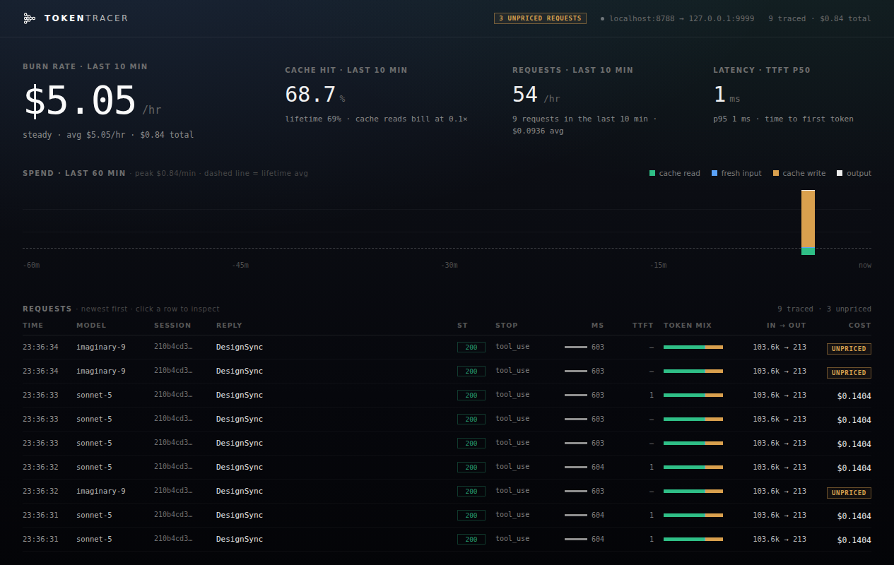

<p align="center">
  <a href="https://github.com/guydelarea/tokentracer">
    
  </a>
</p>

<p align="center">
  A local observability proxy for AI coding agents.
</p>

<p align="center">
  <a href="LICENSE"></a>
  
  
  
</p>

<p align="center">
  <a href="#quickstart">Quickstart</a> &middot;
  <a href="#dashboard">Dashboard</a> &middot;
  <a href="#what-it-records">What it records</a> &middot;
  <a href="#configuration">Configuration</a> &middot;
  <a href="#contributing">Contributing</a>
</p>

<p align="center">
  
</p>

---

**TokenTracer** sits between an LLM client and its model API. It forwards requests unchanged, streams responses straight back to the client, and records the traffic locally for inspection.

See what each coding-agent request costs, what is filling the context window, and the request and decoded response behind every entry. One static Go binary, one dependency, no build step.

The governing rule is **facts, not interpretations**: usage is stored exactly as the API reported it, and cost is computed when you read it. A corrected price list fixes history instead of rewriting it — there is no cost column anywhere in the database.

```
tool schemas    230.7 KB   76%     ← the request is mostly your tools, not your prompt
system prompt    28.8 KB    9%
message history  44.4 KB   15%

Workflow         21.1 KB          DesignSync  9.1 KB          list_projects  149 B
```

### Quickstart

```bash
git clone https://github.com/guydelarea/tokentracer.git
cd tokentracer
go run ./cmd/tokentracer
```

On first run it asks one question — which client you use — and saves the answer to `./.env`:

```text
tokentracer: first-run setup — which client?
  1) Claude Code — Anthropic API (default)
  2) Claude Code — Vertex AI
  3) Other — paste an upstream base URL
```

Pick 2 for **Vertex AI** and it asks for your region (blank = global), pointing the proxy at the right Google endpoint. Auth (your `gcloud` ADC token) passes through untouched. Re-run the wizard anytime with `go run ./cmd/tokentracer setup`; a set `UPSTREAM` env var always outranks the saved answer, and non-interactive runs (pipes, CI) skip the wizard and use the defaults.

Then it listens on `:8787` and forwards upstream, writing `./tokentracer.db`. In another terminal, launch your client through the proxy — the startup log prints the exact line for your backend:

```bash
# Anthropic API
ANTHROPIC_BASE_URL=http://localhost:8787 claude

# Vertex AI
CLAUDE_CODE_USE_VERTEX=1 ANTHROPIC_VERTEX_BASE_URL=http://localhost:8787 claude
```

Open [localhost:8787/dashboard](http://localhost:8787/dashboard) and work as usual. Rows land within two seconds.

Build a static binary:

```bash
CGO_ENABLED=0 go build ./cmd/tokentracer
```

### Dashboard

The dashboard polls every two seconds. It has three screens, and they nest:

- **Overview** — burn rate, **could have saved**, cache-hit rate, requests/hr, a 60-minute spend timeline stacked by class (cache read, fresh input, cache write, output), and the **sessions table**.
  There is no flat request log. A request is not a thing anyone did — a session is — and the twenty requests that made up one turn are noise until you have picked the session they belong to.
- **Session trace** — click a session. Where its money went: the context staircase (every request re-ships the whole conversation, and the cumulative-$ line over it is the integral of that climb), what the replies were made of, which requests broke the cache **and why**, what the tools have dumped into the context, and a **cut list** — the schemas it ships on every request and has never once called, priced one at a time.
- **Inspector** — click a request. Its billing split, its byte composition, system prompt, message history, decoded response, raw body.

**Do next** is the point of the whole thing. Each card is a fact with a price on it, ranked by what it costs, and each one is computed in Go where a test can hold it to account. On a real Claude Code session: *119 schemas ride on every request and were never invoked* — 53.7k tokens, resent every turn. Your prompt is not what costs you money.

Cache breaks are priced the only honest way: at what the request cost **above what a cache hit would have cost**. An idle gap past the 5-minute TTL re-writes the entire prefix even though not one byte changed — on the session in the screenshot, that alone re-billed $0.92 of a $1.18 bill.

Every number is folded server-side in Go. The page only words and draws them — including the advice.

### Unpriced, never $0

A model with no entry in the rate table is reported as **unpriced** — a badge in the log and a counter in the header. It is never quietly billed at some neighbour's price and never silently worth $0. A wrong cost is invisible; an unpriced one is a question you can answer.

The bill follows the model that **served** the request, not the one that was asked for. Those differ more often than you would think, and the difference is money.

Rates live in `internal/billing/rates.go`, generated from [LiteLLM's price registry](https://github.com/BerriAI/litellm/blob/main/model_prices_and_context_window.json). Cache reads bill at 0.1x input, cache writes at 1.25x (5-minute) or 2x (1-hour), and requests above 200K input tokens price on Anthropic's long-context tier — which Claude Code sessions live near, so ignoring it would skew exactly the expensive requests.

> [!NOTE]
> If you are on a Claude subscription you are **not** paying per token. Read the number as *"what this usage would have cost on the API"* — the right number for comparing requests, models and habits against each other, and not your bill.

### Supported clients

v1 records the **Anthropic Messages API** (`POST /v1/messages`, streaming and not) — that is Claude Code — and the same calls in their **Vertex AI** spelling (`.../publishers/anthropic/models/<model>:streamRawPredict` and `:rawPredict`, where the model rides in the URL). Any client that speaks either and can override its base URL works; existing authentication headers pass through unchanged.

| Client | Status | Connection |
| --- | --- | --- |
| [Claude Code](https://claude.com/claude-code) | Tested | `ANTHROPIC_BASE_URL=http://localhost:8787` |
| Claude Code via Vertex AI | Should work | Pick *Vertex AI* in the setup wizard, then `CLAUDE_CODE_USE_VERTEX=1 ANTHROPIC_VERTEX_BASE_URL=http://localhost:8787` |
| Anthropic Messages API client | Should work | Set its base URL to `http://localhost:8787` |
| [OpenCode](https://opencode.ai), [Codex](https://developers.openai.com/codex), [Cursor](https://cursor.com) | Not yet | See the [roadmap](#roadmap) |

Everything else on any other path is proxied through untouched and never recorded, including `count_tokens` (on Vertex: the `count-tokens` pseudo-model).

Sessions are grouped by Claude Code's `session_id`, which it buries inside the `metadata.user_id` string. A client that sends none is recorded fine and groups under `unknown`.

### What it records

One SQLite file, and it is the only source of truth. No boot replay, no in-memory ring, no sidecar directory.

- **`requests`** — the facts. Usage verbatim from the API, latency (duration and time-to-first-token), status, stop reason, and the request's byte composition. This is what the dashboard reads and what you can query by hand.
- **`captures`** — the drill-down blobs, gzipped: the verbatim request body and the fully assembled response message. Deletable without touching a single fact.

```bash
sqlite3 tokentracer.db 'select model_req, session_id, tool_count, input_tokens, ttft_ms from requests'
```

Things worth knowing:

- **An aborted generation is still recorded.** Hit esc in Claude Code and Anthropic still bills what it generated — so the proxy detaches from the departed client, drains the upstream stream to the end, and records the real usage with `aborted=1`. That spend is invisible to every JSONL-reading tool.
- **Nothing recorded is lost.** A body the parser cannot read still lands as a row that says why, keeping the facts that needed no parser and the capture that reproduces the failure. Ctrl-C flushes the queue before the database closes.
- **The response blob is the whole assembled message** — thinking text and signature, tool inputs as real JSON, usage, the model that actually served it. Its predecessor stored a lossy summary and could never answer a question it had not already thought of.

### Logs and security

> [!WARNING]
> Request bodies are captured. **Headers are never written to disk** — your API key lives in `x-api-key` and `Authorization` and never reaches the database — and known credential shapes are stripped out of the bodies (below). Everything else you send in an agent *message* is stored as sent: source, customer data, whatever the session read. Treat `tokentracer.db` as sensitive material. Gzip is not encryption.

**Redaction.** Before a capture is stored, `internal/redact` replaces the things that are only ever secrets: `sk-ant-…`/`sk-…`, GitHub `ghp_…`, Google `AIza…`, Slack `xox…`, AWS key ids and `aws_secret_access_key`, JWTs, PEM private-key blocks, and named values in JSON fields, `Authorization`/`x-api-key` headers and `KEY=`/`TOKEN=`/`PASSWORD=` assignments. Each becomes `[redacted:<kind>]`, keeping the field name — that a session exported `ANTHROPIC_API_KEY` is worth knowing; what it exported is not. Responses are redacted too, since a model that echoes a pasted key back leaks it just the same.

This runs on the bytes headed for the database and nothing else. The client's stream is untouched, and every fact is folded from the verbatim body first, so no byte count, token figure or cache-prefix hash moves. It is a scalpel, not an entropy filter: it will not catch a credential in a format nobody has enumerated, and it deliberately leaves hashes, ids and base64 payloads alone rather than shredding the evidence a capture exists to be.

The proxy and the dashboard share one port, and the dashboard reads those captures back out. So `/dashboard`, `/api/stats` and `/api/capture` answer **404 to anything that is not this machine**, and the listener binds `127.0.0.1` besides. Two locks, because one is not enough for a file that holds every prompt you have ever sent.

To reach the dashboard from elsewhere, forward the port over SSH — `ssh -L 8787:localhost:8787 devbox` — which keeps it loopback, and is what you want.

### Disk

Captures are the expensive part, and they are bigger than you would guess. Measured on a real Claude Code turn (300 KB request, 119 tool schemas):

- **~100 KB gzipped per request**, dominated by the tool schemas resent on every turn.
- 10 requests ≈ 1 MB. A heavy day of a few thousand requests is **hundreds of MB**.

So the dashboard header carries the control: **keep captures forever / 24 hours / 7 days / 30 days**, plus a **purge** that drops all of them now. The window is stored in the database, applied the moment you set it, and re-applied hourly and at startup. It defaults to *forever* — retention deletes evidence, so it only runs because you asked. A sweep that deletes anything vacuums after itself, or the file would never actually shrink.

Deleting captures never touches the facts — the sessions table, every trace, all costs, and the cache diagnosis survive, because the prefix hashes and the output split live on the request row, not in the blob. Only what can be read *nowhere else* goes: the itemized schemas, the cut list, and the per-request drill-down, which degrade to the byte splits already on the row.

The equivalent by hand, if you prefer:

```bash
sqlite3 tokentracer.db 'delete from captures'   # reclaim the space
sqlite3 tokentracer.db 'vacuum'                 # hand it back to the filesystem
```

### Analyze the database

It is plain SQLite, so it works with tools you already use. Usage by model:

```bash
sqlite3 tokentracer.db "
  select coalesce(model_served, model_req) as model,
         count(*)                  as requests,
         sum(input_tokens)         as input_tokens,
         sum(cache_read_tokens)    as cache_reads,
         sum(output_tokens)        as output_tokens
  from requests
  group by model
  order by input_tokens desc;
"
```

The rows hold raw API usage and no prices — pricing happens on read, in `internal/billing`. That is deliberate: sums like the one above are fine for tokens, but they cannot price correctly, because whether a request crossed the long-context threshold is a per-request fact that `group by` destroys.

### Configuration

Environment variables, or `KEY=value` lines in `./.env` (written by the first-run wizard; a shell-set variable always wins over the file).

| Variable | Default | Meaning |
| --- | --- | --- |
| `PORT` | `8787` | Local listen port (proxy, dashboard and API share it) |
| `UPSTREAM` | `https://api.anthropic.com` | Upstream base URL (`https://<region>-aiplatform.googleapis.com/v1` for Vertex) |
| `TOKENTRACER_DB` | `./tokentracer.db` | SQLite path, created on first run |

### Development

```bash
go run ./cmd/tokentracer     # start the proxy on :8787
go test ./...                # the suite
go test ./... -race
gofmt -w . && go vet ./...
```

The tests run against a real capture from a real Claude Code session (`testdata/`), and the adversarial cases are the point of them: truncated streams, unknown event types, panicking parsers, dead databases, and clients that hang up mid-generation. The one that matters most makes the fake upstream refuse to send a second chunk until the client has observed the first — so a proxy that buffers deadlocks and fails.

Layout:

```
cmd/tokentracer     wiring, config, shutdown order
internal/proxy      the client path: forward, stream, stamp, hand over. Zero parsing.
internal/record     the Recorder: never loses an exchange it saw
internal/anthropic  vendor module: parse, break down, decode SSE. Pure functions.
internal/billing    read-time pricing, generated rate table
internal/store      SQLite: schema, one-transaction writes, three read queries
internal/api        the fold — every number the dashboard shows — plus the routes
web/                the dashboard, embedded with go:embed
```

One vendor per package, one file per vendor. A second one (`internal/openai/`) follows that shape.

### Contributing

Issues and pull requests are welcome. The most valuable contributions are:

- OpenAI Chat Completions and Responses parsing, for Codex, Cursor and OpenCode.
- Credential shapes the redactor does not know yet (`internal/redact`), with a test case each.
- Updates to the rate table as models and pricing change.

Before opening a pull request:

```bash
gofmt -w . && go vet ./... && go test ./... -race
```

Keep changes focused. Add a real test for non-trivial behavior — and prefer one that fails for the right reason over one that merely passes.

### Roadmap

- [x] Sessions and Trace views
- [x] **Improve**: ranked money-leak recommendations — unused tool schemas, exploration re-reads, cache breaks, compaction candidates
- [x] Request-body secret redaction
- [x] Capture auto-pruning
- [ ] OpenAI-compatible request parsing (Codex, Cursor, OpenCode)

### License

[MIT](LICENSE) © Guy Delarea

### Credits

A clean-room rewrite of [tokentrace](https://github.com/guydelarea/tokentrace), which started as a Go port of [Matt Pocock's proxy.mjs](https://gist.github.com/mattpocock/5b3d76ea21f5f698aefded47a9cea3b1). The logo and the dashboard are the parts worth keeping; everything behind them was written fresh.
